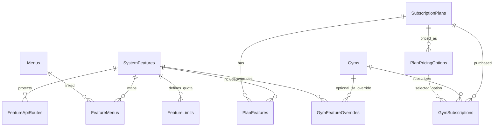

# Dynamic Feature-Driven SaaS Subscription — Architecture Proposal

**Status:** Proposal (no implementation yet)  
**Date:** 2026-06-21  
**Scope:** Replace hardcoded plans, billing cycles, and plan-tier menu logic with a Super Admin–configurable feature-driven subscription system.

---

## 1. Current State Analysis

### 1.1 What exists today

| Layer | Current behavior | Hardcoded? |
|-------|------------------|------------|
| **Plans** | 4 rows in `SaasSubscriptionPlans`: Trial, Basic, Premium, Enterprise | Codes in C# (`SaasPlanCodes`) + SQL MERGE seed |
| **Pricing** | 4 columns: `MonthlyPrice`, `QuarterlyPrice`, `HalfYearlyPrice`, `YearlyPrice` | Cycle names in C# + SQL function |
| **Features / menus** | `dbo.Menus` catalog (40+ modules) + per-gym `GymMenus.IsEnabled` | Menu catalog seeded in SQL; Super Admin toggles per gym |
| **Plan ↔ menu link** | **None.** Menus are tenant-scoped, not plan-scoped | Gym gets all menus on seed; SA enables/disables manually |
| **API enforcement** | `GymMenuAccessMiddleware` + `ApiRouteMenuMap` → menu code | Route map in C# |
| **RBAC** | `MenuPermissionMap` → permissions per menu | C# dictionary |
| **Limits** | `MaxMembers`, `MaxTrainers`, `StorageLimitMb`, `WhatsAppNotificationLimit` on plan row | Only members/trainers enforced in code |
| **Super Admin plan CRUD** | **Does not exist** | Plans edited via DB only |
| **Gym Admin** | View plans, purchase via Razorpay, renew/upgrade | Cannot edit pricing ✓ (already) |

### 1.2 Gap vs requirements

```
Today:
  Plan (fixed tier) ──► Limits only
  GymMenus (manual SA toggle) ──► Menu visibility

Required:
  Plan (dynamic) ──► Features ──► Menus + API access + optional limits
  Pricing options (dynamic duration + price)
  Super Admin full plan lifecycle
```

### 1.3 Key insight: reuse vs replace `dbo.Menus`

`dbo.Menus` already stores `MenuCode`, `MenuName`, `Route`, `Icon`, hierarchy. The new **`SystemFeatures`** table should be the **subscription entitlement catalog**. Relationship:

- **1 feature → 0..n menus** (e.g. `WHITE_LABEL` → `WHITE_LABEL`, `GYM_BRANDING`)
- **1 feature → 0..n API route prefixes** (for middleware)
- **1 feature → optional quota limits** (members, trainers, storage, WhatsApp)

Menus remain the UI navigation layer; features are what plans sell.

---

## 2. Database Design

### 2.1 Entity relationship (target)



### 2.2 New / modified tables

#### `dbo.SystemFeatures` (master feature catalog)

| Column | Type | Notes |
|--------|------|-------|
| FeatureId | INT PK IDENTITY | |
| FeatureCode | NVARCHAR(50) UNIQUE | e.g. `WEBSITE_BUILDER`, `CRM_LEADS` |
| FeatureName | NVARCHAR(100) | Display name |
| Description | NVARCHAR(500) NULL | |
| Category | NVARCHAR(50) | Core, Operations, Marketing, Advanced, Platform |
| MenuRoute | NVARCHAR(200) NULL | Primary route (informational; actual routes via FeatureMenus) |
| MenuIcon | NVARCHAR(50) NULL | Material icon name |
| IsMenuFeature | BIT | If true, controls sidebar visibility |
| IsApiFeature | BIT | If true, controls API middleware |
| IsQuotaFeature | BIT | If true, reads limits from PlanFeatureLimits |
| SortOrder | INT | Admin UI ordering |
| IsActive | BIT | Soft-disable feature globally |
| CreatedAt / UpdatedAt | DATETIME2 | |

**Seed mapping from existing `MenuCodes` (proposed feature groups):**

| FeatureCode | FeatureName | Category | Maps from MenuCodes |
|-------------|-------------|----------|---------------------|
| DASHBOARD | Dashboard | Core | DASHBOARD |
| MEMBERS | Members | Core | MEMBERS |
| TRAINERS | Trainers | Core | TRAINERS |
| ATTENDANCE | Attendance | Operations | ATTENDANCE, ATTENDANCE_REPORTS |
| MEMBERSHIPS | Memberships | Operations | MEMBERSHIPS, MEMBERSHIP_PLANS |
| DIET_PLANS | Diet Plans | Operations | DIET_PLANS |
| WORKOUT_PLANS | Workout Plans | Operations | WORKOUT_PLANS |
| CRM_LEADS | CRM Leads | Operations | CRM, LEADS |
| PAYMENTS | Payments | Operations | PAYMENTS, REVENUE |
| REPORTS | Reports | Operations | REPORTS, ANALYTICS, *_ANALYTICS, FINANCIAL |
| NOTIFICATIONS | Notifications | Operations | NOTIFICATIONS, MOBILE_* |
| MULTI_BRANCH | Multi Branch | Advanced | BRANCHES, BRANCH_* |
| WHITE_LABEL | White Label | Marketing | WHITE_LABEL, GYM_BRANDING |
| WEBSITE_BUILDER | Website Builder | Marketing | WEBSITE_BUILDER, WEBSITE_ANALYTICS |
| PUBLIC_WEBSITE | Public Website | Marketing | PUBLIC_WEBSITE |
| AI_INSIGHTS | AI Insights | Advanced | AI_INSIGHTS, AI_* |
| BOOKINGS | Bookings | Operations | BOOKINGS, CLASS_SCHEDULES, BOOKING_ANALYTICS |
| EXPENSES_PAYROLL | Expenses & Payroll | Operations | EXPENSES, PAYROLL |
| INVENTORY | File / Inventory | Operations | INVENTORY |
| AUDIT_LOGS | Audit Logs | Platform | AUDIT_LOGS |
| SUBSCRIPTIONS | Subscription Mgmt | Core | SUBSCRIPTIONS (always-on for gym admin) |

#### `dbo.FeatureMenus` (feature → menu many-to-many)

| Column | Type |
|--------|------|
| FeatureMenuId | INT PK |
| FeatureId | INT FK → SystemFeatures |
| MenuId | INT FK → Menus |
| UNIQUE (FeatureId, MenuId) | |

#### `dbo.FeatureApiRoutes` (feature → API protection)

| Column | Type |
|--------|------|
| FeatureApiRouteId | INT PK |
| FeatureId | INT FK |
| RoutePrefix | NVARCHAR(200) | e.g. `/api/website` |
| HttpMethods | NVARCHAR(50) NULL | NULL = all |
| UNIQUE (FeatureId, RoutePrefix) | |

Migrates content from `ApiRouteMenuMap.cs` into DB (with C# cache/fallback during transition).

#### `dbo.SubscriptionPlans` (replaces `SaasSubscriptionPlans` concept)

| Column | Type | Notes |
|--------|------|-------|
| PlanId | INT PK | Renamed from SaasPlanId (migration alias) |
| PlanCode | NVARCHAR(50) UNIQUE | **Auto-generated slug**, not fixed enum |
| PlanName | NVARCHAR(100) | SA-defined |
| Description | NVARCHAR(1000) NULL | |
| IsTrialPlan | BIT | Replaces Trial plan code check |
| TrialDays | INT | 0 if not trial |
| IsActive | BIT | |
| IsPublic | BIT | Show on onboarding |
| SortOrder | INT | |
| CreatedAt / UpdatedAt | DATETIME2 | |

**Removed from plan row:** `MonthlyPrice`, `QuarterlyPrice`, `HalfYearlyPrice`, `YearlyPrice`, `MaxMembers`, etc. → moved to pricing options + feature limits.

#### `dbo.PlanPricingOptions` (dynamic duration + price)

| Column | Type | Notes |
|--------|------|-------|
| PricingOptionId | INT PK | |
| PlanId | INT FK | |
| DurationValue | INT | e.g. 1, 3, 6, 12, 45, 2 |
| DurationUnit | NVARCHAR(20) | `Day`, `Month`, `Year` |
| Price | DECIMAL(18,2) | SA-controlled |
| Currency | NVARCHAR(3) | Default INR |
| DisplayLabel | NVARCHAR(100) NULL | e.g. "12 Months — Best Value" |
| IsActive | BIT | |
| SortOrder | INT | |
| UNIQUE (PlanId, DurationValue, DurationUnit) | | |

**Period end calculation (replaces `SaasBillingCycleHelper` / `fn_Saas_CalculatePeriodEnd`):**

```sql
CREATE FUNCTION fn_CalculatePeriodEnd(@Start DATETIME2, @Value INT, @Unit NVARCHAR(20))
RETURNS DATETIME2 AS
  CASE UPPER(@Unit)
    WHEN 'DAY'   THEN DATEADD(DAY,   @Value, @Start)
    WHEN 'MONTH' THEN DATEADD(MONTH, @Value, @Start)
    WHEN 'YEAR'  THEN DATEADD(YEAR,  @Value, @Start)
  END
```

#### `dbo.PlanFeatures` (plan ↔ feature)

| Column | Type |
|--------|------|
| PlanFeatureId | INT PK |
| PlanId | INT FK |
| FeatureId | INT FK |
| IsIncluded | BIT | Checkbox in SA UI |
| UNIQUE (PlanId, FeatureId) | |

#### `dbo.PlanFeatureLimits` (optional quotas per plan per feature)

| Column | Type | Notes |
|--------|------|-------|
| PlanFeatureLimitId | INT PK | |
| PlanId | INT FK | |
| FeatureId | INT FK | Must be quota-capable feature |
| LimitKey | NVARCHAR(50) | `MaxMembers`, `MaxTrainers`, `StorageLimitMb`, `WhatsAppMonthly` |
| LimitValue | INT | -1 = unlimited |
| UNIQUE (PlanId, FeatureId, LimitKey) | |

#### `dbo.GymSubscriptions` (modified)

| Column | Change |
|--------|--------|
| PlanId | FK → SubscriptionPlans (rename SaasPlanId) |
| PricingOptionId | **NEW** FK → PlanPricingOptions (snapshot at purchase) |
| DurationValue / DurationUnit | **NEW** denormalized from pricing option |
| BillingCycle | **DEPRECATED** → kept nullable for migration |
| SubscriptionStart | Alias CurrentPeriodStart |
| SubscriptionEnd | Alias CurrentPeriodEnd |

#### `dbo.GymFeatureOverrides` (optional — Super Admin per-gym exceptions)

| Column | Type | Notes |
|--------|------|-------|
| GymFeatureOverrideId | INT PK | |
| GymId | UNIQUEIDENTIFIER FK | |
| FeatureId | INT FK | |
| IsEnabled | BIT | Override plan entitlement |
| Reason | NVARCHAR(500) NULL | Audit |
| OverriddenBy | UNIQUEIDENTIFIER | |
| OverriddenAt | DATETIME2 | |

**Decision:** Keep `GymMenus` during transition, then deprecate in favor of plan features + overrides. SA "tenant menu management" becomes "feature overrides" UI.

### 2.3 Views / computed helpers

| Object | Purpose |
|--------|---------|
| `vw_GymEffectiveFeatures` | `PlanFeatures` ∪ `GymFeatureOverrides` for active subscription |
| `vw_GymEnabledMenus` | Effective features → FeatureMenus → Menus |
| `sp_GetGymFeatureCodes` | Returns feature codes for a gym (cached on login) |

---

## 3. API Design

### 3.1 Super Admin — Plan Management

**Base route:** `/api/platform/subscription-plans`  
**Permission:** `MANAGE_SUBSCRIPTION_PLANS` (new)

| Method | Path | Description |
|--------|------|-------------|
| GET | `/` | List all plans (paginated, include feature counts) |
| GET | `/{planId}` | Plan detail + features + pricing options + limits |
| POST | `/` | Create plan |
| PUT | `/{planId}` | Update plan metadata |
| PUT | `/{planId}/activate` | Set IsActive = 1 |
| PUT | `/{planId}/deactivate` | Set IsActive = 0 |
| DELETE | `/{planId}` | Soft-delete if no active subscriptions |

**Features sub-resource:** `/api/platform/subscription-plans/{planId}/features`

| Method | Path | Description |
|--------|------|-------------|
| GET | `/` | Selected features with checkboxes state |
| PUT | `/` | Bulk replace plan features `{ featureCode: bool }[]` |
| PUT | `/limits` | Update quota limits `{ maxMembers, maxTrainers, ... }` |

**Pricing sub-resource:** `/api/platform/subscription-plans/{planId}/pricing-options`

| Method | Path | Description |
|--------|------|-------------|
| GET | `/` | All pricing options |
| POST | `/` | Add duration + price |
| PUT | `/{pricingOptionId}` | Edit price / duration / label |
| DELETE | `/{pricingOptionId}` | Soft-deactivate |

### 3.2 Super Admin — Feature Catalog

**Base route:** `/api/platform/system-features`

| Method | Path | Description |
|--------|------|-------------|
| GET | `/` | All features (grouped by category) |
| GET | `/{featureCode}` | Feature detail + linked menus/routes |
| PUT | `/{featureId}` | Update metadata (not code) |
| PUT | `/{featureId}/activate` | Toggle IsActive |

> Feature **codes** are seeded; SA cannot create arbitrary new feature codes in v1 (prevents broken API maps). SA selects which seeded features each plan includes.

### 3.3 Gym Admin — Read-only plan catalog

**Base route:** `/api/saas/plans` (extend existing)

| Method | Path | Description |
|--------|------|-------------|
| GET | `/` | Public/active plans with pricing options + **feature comparison matrix** |
| GET | `/{planId}` | Single plan detail for comparison page |
| GET | `/compare?planIds=1,2,3` | Side-by-side feature matrix |

**No PUT/POST/DELETE** for gym admin on plans or pricing.

### 3.4 Gym Admin — Subscription (extend existing)

| Method | Path | Change |
|--------|------|--------|
| POST | `/api/saas/payments/order` | Body: `{ planId, pricingOptionId }` instead of `billingCycle` |
| POST | `/api/saas/payments/verify` | Unchanged flow; stores PricingOptionId |
| GET | `/api/saas/subscription` | Include `enabledFeatures[]`, `pricingOption` |
| GET | `/api/saas/my-features` | **NEW** — resolved feature codes for UI |

### 3.5 Auth / session changes

`GET /api/auth/session` response adds:

```json
{
  "enabledFeatureCodes": ["DASHBOARD", "MEMBERS", "WHITE_LABEL"],
  "enabledMenuCodes": ["DASHBOARD", "MEMBERS", "WHITE_LABEL"],
  "subscription": { "planName": "...", "subscriptionEnd": "..." }
}
```

`enabledMenuCodes` becomes **derived** from plan features (not independent SA toggles by default).

### 3.6 Feature validation middleware

**New:** `FeatureAccessMiddleware` (runs after auth, alongside subscription + menu middleware)

```
Request → Resolve route → FeatureApiRoutes → Required FeatureCode
         → FeatureResolverService.HasFeature(gymId, featureCode)
         → 403 FeatureNotIncluded if missing
```

**New attribute:** `[RequireFeature("WEBSITE_BUILDER")]` on controllers/actions as declarative fallback.

**New service:** `IFeatureResolverService`

```csharp
Task<IReadOnlySet<string>> GetEnabledFeatureCodesAsync(Guid gymId);
Task<bool> HasFeatureAsync(Guid gymId, string featureCode);
Task EnsureFeatureAsync(Guid gymId, string featureCode); // throws
Task<IReadOnlyList<MenuDto>> GetEnabledMenusAsync(Guid gymId, IEnumerable<string> userPermissions);
```

Resolution order:

1. Active subscription exists (or trial)
2. Plan features (`PlanFeatures` where `IsIncluded = 1`)
3. Apply `GymFeatureOverrides` (if any)
4. Intersect with RBAC permissions
5. Expand to menus via `FeatureMenus`

---

## 4. Angular UI Design

### 4.1 Super Admin — new screens

```
/super-admin/subscription-plans
├── Plan list (table: name, status, #features, price range, subscribers)
├── [Create Plan] → wizard
│   Step 1: Basic info (name, description, trial toggle)
│   Step 2: Feature selection (grouped checkboxes by category)
│   Step 3: Quota limits (members, trainers, storage, WhatsApp)
│   Step 4: Pricing options (dynamic rows: duration value + unit + price)
│   Step 5: Review & publish
└── Plan edit (same sections as tabs)

/super-admin/system-features (read-only catalog v1)
└── Feature list with linked menus/routes (informational)

/super-admin/gyms/{gymId}/feature-overrides (optional v1.1)
└── Override plan features for specific gym
```

**Components:**

| Component | Purpose |
|-----------|---------|
| `PlanListComponent` | CRUD entry point |
| `PlanEditorComponent` | Tabbed editor |
| `FeatureSelectorComponent` | Reusable checkbox grid grouped by category |
| `PricingOptionsEditorComponent` | Dynamic FormArray: value + unit + price |
| `PlanLimitsEditorComponent` | Numeric inputs for quotas |
| `FeatureComparisonMatrixComponent` | Shared with gym admin compare view |

### 4.2 Gym Admin — redesigned screens

```
/gym-admin/subscription          (existing route — redesign)
├── Current plan card (name, end date, enabled feature summary)
├── Plan catalog cards (from API, no hardcoded tiers)
├── Compare plans → /gym-admin/subscription/compare
└── Purchase flow: select plan → select duration/pricing → Razorpay

/gym-admin/subscription/compare  (NEW)
└── Feature matrix table (☑/☐ per plan column)
```

**Remove:**

- `SAAS_BILLING_CYCLE_OPTIONS` hardcoded 4 cycles → render from `plan.pricingOptions[]`
- `plan.planCode !== 'Trial'` → use `plan.isTrialPlan`
- `getPlanPriceForCycle()` → `pricingOption.price`

### 4.3 Menu rendering (feature-driven)

**Current:**

```typescript
// menu.service.ts — falls back to static GYM_ADMIN_MENU
if (enabledMenuCodes.includes(code)) ...
```

**Target:**

```typescript
// menu.service.ts
computed sidebar = apiMenusFromMyMenus(); // backend already filtered by features ∩ permissions

// gym-menu.guard.ts
canActivate = enabledFeatureCodes.includes(requiredFeature); // or menu code from route map

// No references to plan name/code for visibility
auth.hasFeature('WEBSITE_BUILDER'); // new helper
```

**New files:**

| File | Purpose |
|------|---------|
| `core/models/feature.models.ts` | SystemFeature, PlanPricingOption, PlanComparison |
| `core/services/feature.service.ts` | `hasFeature()`, cache from session |
| `core/constants/feature-codes.ts` | TypeScript const enum mirroring DB (not plan tiers) |
| `shared/components/feature-matrix/` | Compare table |

### 4.4 Route guards update

| Guard | Change |
|-------|--------|
| `gymMenuGuard` | Check `enabledFeatureCodes` via route → feature map (replace menu-only check) |
| `permissionGuard` | Unchanged (RBAC still required) |
| `subscriptionGuard` | Unchanged |

**New map:** `route-feature-codes.ts` (parallel to `route-menu-codes.ts`)

```typescript
'/gym-admin/website-builder': 'WEBSITE_BUILDER',
'/gym-admin/white-label': 'WHITE_LABEL',
```

---

## 5. Migration Plan

### 5.1 Script sequence

| Script | Purpose |
|--------|---------|
| `059_SystemFeatures.sql` | Create SystemFeatures, FeatureMenus, FeatureApiRoutes; seed from Menus |
| `060_DynamicSubscriptionPlans.sql` | SubscriptionPlans rename/extend, PlanPricingOptions, PlanFeatures, PlanFeatureLimits |
| `061_MigrateLegacyPlans.sql` | Data migration (below) |
| `062_FeatureBasedMenus.sql` | Update `sp_GymMenu_GetEnabledCodes` to use plan features; deprecate standalone GymMenus seed |
| `063_GymSubscriptionPricingOption.sql` | Add PricingOptionId to GymSubscriptions; backfill |

### 5.2 Legacy plan mapping

| Legacy PlanCode | New PlanName | Proposed features | Pricing backfill |
|-----------------|--------------|-------------------|------------------|
| Trial | Trial (IsTrialPlan=1) | Core only: Dashboard, Members, Trainers, Attendance, Memberships | TrialDays from row |
| Basic | Basic (migrated) | Core + Operations (no White Label, Website, AI, Multi Branch) | 1/3/6/12 Month from existing price columns |
| Premium | Premium (migrated) | Basic + CRM, Reports, Notifications, Multi Branch | Same |
| Enterprise | Enterprise (migrated) | All features | Same |

**Billing cycle → pricing option mapping:**

| Old BillingCycle | DurationValue | DurationUnit |
|------------------|---------------|--------------|
| Monthly | 1 | Month |
| Quarterly | 3 | Month |
| HalfYearly | 6 | Month |
| Yearly | 12 | Month |

**Active subscriptions:** For each `GymSubscriptions` row:

1. Set `PricingOptionId` by matching `(SaasPlanId, BillingCycle)` → new option
2. If no match, create ad-hoc pricing option from `Amount` + inferred duration
3. Preserve `CurrentPeriodStart/End`, `GraceEndsAt`

**GymMenus → plan features:** For each gym:

1. Read currently enabled menu codes
2. When migrating, set `GymFeatureOverrides` only where gym had SA custom toggles differing from their plan's default
3. New purchases: features come purely from plan

### 5.3 C# deprecation path

| Remove / deprecate | Replace with |
|--------------------|--------------|
| `SaasPlanCodes` constants | DB-driven plan codes |
| `SaasBillingCycles` constants | `DurationUnit` enum + DB pricing options |
| `SaasBillingCycleHelper` | `SubscriptionDurationCalculator` |
| `fn_Saas_CalculatePeriodEnd` | `fn_CalculatePeriodEnd` |
| 4 price columns on plan DTO | `PlanPricingOptionDto[]` |
| `ChangeSaasPlanDto` (unused) | SA plan update DTOs |

### 5.4 Rollback strategy

- Keep `BillingCycle` column nullable for 2 releases
- Feature flag: `Subscription:UseFeatureDrivenPlans` (default false until migration verified)
- Dual-read: if no PricingOptionId, fall back to BillingCycle calculation

---

## 6. Impact Analysis

### 6.1 Backend files affected

| Area | Files | Impact |
|------|-------|--------|
| Constants | `SaasConstants.cs`, `MenuCodes.cs` | Deprecate plan/cycle constants; keep menu codes |
| Services | `SaasSubscriptionService`, `SaasBillingCycleHelper`, `GymMenuService`, `TenantLimitService` | Major refactor |
| New | `FeatureResolverService`, `PlanManagementService` | New |
| Middleware | `GymMenuAccessMiddleware` → merge with `FeatureAccessMiddleware` | Medium |
| Authorization | `ApiRouteMenuMap.cs` | Move routes to DB; keep C# fallback |
| Repositories | `SaasSubscriptionRepository` | New SPs for plans/features/pricing |
| Controllers | `SaasControllers.cs` | Extend + new `PlatformSubscriptionPlansController` |
| SQL | 5 new scripts (059–063) | High |
| Background jobs | Expiry job | Low (unchanged logic) |
| Tests | `SaasBillingCycleTests`, `SubscriptionRenewalDateTests` | Rewrite for duration units |

### 6.2 Frontend files affected

| Area | Impact |
|------|--------|
| `gym-subscription.component.*` | Major redesign |
| `saas-billing-cycles.ts` | **Remove** — dynamic pricing options |
| `saas.models.ts` | New DTOs |
| `menu.service.ts`, `gym-menu.guard.ts` | Feature-driven |
| `tenant-menu-management` | Repurpose or deprecate |
| Super admin routes | New plan management module |
| E2E tests | Update plan/feature assertions |

### 6.3 Risk register

| Risk | Severity | Mitigation |
|------|----------|------------|
| Existing gyms lose menus after migration | High | GymFeatureOverrides backfill; validation script pre-migration |
| Razorpay orders reference old billingCycle | Medium | Store pricingOptionId in order metadata |
| Platform MRR dashboard only counts Monthly/Yearly | Medium | Update `sp_Saas_GetPlatformDashboard` to normalize all durations to monthly equivalent |
| SA creates plan with zero features | Medium | Validation: require DASHBOARD + SUBSCRIPTIONS minimum |
| Performance (feature resolve per request) | Low | Cache features in session claims; invalidate on subscription change |
| Feature catalog drift (new module added) | Medium | Migration template: new module = seed feature + menus + routes |

### 6.4 What stays unchanged

- Razorpay payment verify flow (signature, order lookup)
- Subscription renewal carry-forward logic (period stacking)
- Grace period / expiry middleware flow
- RBAC permission system (features gate *plan*, permissions gate *role*)
- Trial auto-creation on onboarding
- `SubscriptionAccessService` access modes

---

## 7. Implementation Plan

### Phase 0 — Design sign-off (1 week)

- [ ] Review and approve this document
- [ ] Confirm feature catalog list with product owner
- [ ] Decide: deprecate `GymMenus` SA UI or keep as overrides
- [ ] Confirm v1: SA cannot create new FeatureCodes (seed-only)

### Phase 1 — Database & seed (1.5 weeks)

- [ ] Scripts 059–061: tables + seed features + migrate legacy plans/pricing
- [ ] Validation SQL: every menu has a feature; every plan has ≥1 pricing option
- [ ] Migration dry-run on `GymDb_MigrationAudit`

### Phase 2 — Backend core (2 weeks)

- [ ] `FeatureResolverService` + `PlanManagementService`
- [ ] Update `sp_Saas_UpdateSubscriptionPlan` → accept `@PricingOptionId`
- [ ] `FeatureAccessMiddleware` + `[RequireFeature]`
- [ ] Platform plan CRUD APIs
- [ ] Extend gym-facing plan/compare APIs
- [ ] Update `GetMyMenus` / auth session to use feature resolver
- [ ] Unit + integration tests

### Phase 3 — Super Admin UI (1.5 weeks)

- [ ] Plan list + create/edit wizard
- [ ] Feature selector + pricing options editor
- [ ] Plan activate/deactivate

### Phase 4 — Gym Admin UI (1 week)

- [ ] Redesign subscription page (dynamic plans/pricing)
- [ ] Feature comparison page
- [ ] Update purchase flow to send `pricingOptionId`

### Phase 5 — Menu & guard refactor (1 week)

- [ ] Feature-driven sidebar + route guards
- [ ] Remove billing cycle constants
- [ ] Session refresh after purchase

### Phase 6 — Migration & cutover (0.5 week)

- [ ] Run production migration
- [ ] Enable feature flag
- [ ] Deprecate tenant menu management (or repurpose)
- [ ] Update docs + E2E tests

**Estimated total:** 7–8 weeks

### Phase 7 — Enforcement hardening (ongoing)

- [ ] Enforce storage/WhatsApp quotas (currently display-only)
- [ ] Per-feature usage analytics for SA dashboard
- [ ] Custom plan templates / duplicate plan

---

## 8. Open Questions for Sign-off

1. **Feature catalog mutability:** Can Super Admin add custom features in v1, or only select from seeded catalog?
2. **Tenant menu overrides:** Keep per-gym menu toggles alongside plan features, or plan-only?
3. **Trial plan:** Remain a special `IsTrialPlan` flag, or a regular plan with 0-price pricing option?
4. **Multi-currency:** Required in v1 or INR-only?
5. **Plan deletion:** Hard delete blocked if subscriptions exist — soft delete only?
6. **Public website feature:** Separate from Website Builder, or bundled?

---

## 9. Summary

The current system has **dynamic prices in DB** but **hardcoded plan tiers**, **hardcoded billing cycles**, and **menu visibility decoupled from plans** (manual SA toggles). The proposed architecture introduces a **SystemFeatures** master catalog, **plan-feature assignments**, **dynamic duration/pricing options**, and a **FeatureResolverService** that drives menus, APIs, and quotas from the gym's active subscription.

This aligns with the requirement that Super Admin fully controls what each plan includes — without any reference to Basic/Premium/White Label as fixed code paths — while preserving existing renewal logic, Razorpay integration, and RBAC.

**Next step:** Review open questions → approve Phase 0 → begin Phase 1 database scripts.
