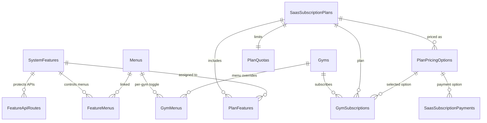

# Phase 1 — Dynamic Feature-Driven SaaS Subscription

**Status:** Complete — awaiting approval for Phase 2  
**Date:** 2026-06-21  
**Scope:** Database schema, migration scripts, seed data, mapping strategy only (no backend/frontend services)

---

## Approved Decisions (Locked)

| # | Decision |
|---|----------|
| 1 | Seeded feature catalog only — SA selects features per plan, cannot create custom codes |
| 2 | No hardcoded plan names in code — legacy tiers become data rows |
| 3 | Dynamic pricing via `DurationValue` + `DurationUnit` (INR only) |
| 4 | Trial = normal plan with `IsTrialPlan = true`, ₹0, N Days |
| 5 | Menu visibility = **PlanFeatureEnabled AND GymMenuEnabled** |
| 6 | Feature checks replace plan-tier checks (Phase 2) |
| 7 | Gym Admin read-only on plans/pricing/features |
| 8 | Preserve renewal carry-forward + Razorpay (Phase 2 wiring) |

---

## 1. Final Database Design

### 1.1 New tables

#### `dbo.SystemFeatures` — master feature catalog (seed-only)

| Column | Type | Notes |
|--------|------|-------|
| FeatureId | INT PK IDENTITY | |
| FeatureCode | NVARCHAR(50) UNIQUE | e.g. `WEBSITE_BUILDER` |
| FeatureName | NVARCHAR(100) | Display name |
| Description | NVARCHAR(500) | |
| Category | NVARCHAR(50) | `Core Features`, `Premium Features`, `Pro Features` |
| MenuRoute | NVARCHAR(200) | Primary UI route (informational) |
| MenuIcon | NVARCHAR(50) | Material icon |
| IsMenuFeature | BIT | Controls menu visibility path |
| IsApiFeature | BIT | Controls API route protection |
| IsQuotaFeature | BIT | Reserved for quota limits (v1: plan-level quotas) |
| SortOrder | INT | |
| IsActive | BIT | Global enable/disable |
| CreatedAt / UpdatedAt | DATETIME2 | |

#### `dbo.FeatureMenus` — feature → menu (M:N)

| Column | Type |
|--------|------|
| FeatureMenuId | INT PK |
| FeatureId | FK → SystemFeatures |
| MenuId | FK → Menus |
| UNIQUE (FeatureId, MenuId) | |

#### `dbo.FeatureApiRoutes` — feature → API prefix (M:N)

| Column | Type |
|--------|------|
| FeatureApiRouteId | INT PK |
| FeatureId | FK → SystemFeatures |
| RoutePrefix | NVARCHAR(200) |
| HttpMethods | NVARCHAR(50) NULL |

#### `dbo.PlanPricingOptions` — dynamic duration + price

| Column | Type | Notes |
|--------|------|-------|
| PricingOptionId | INT PK | |
| SaasPlanId | FK → SaasSubscriptionPlans | |
| DurationValue | INT | > 0 |
| DurationUnit | NVARCHAR(20) | `Day`, `Month`, `Year` |
| Price | DECIMAL(18,2) | INR, ≥ 0 |
| Currency | NVARCHAR(3) | Default `INR` |
| DisplayLabel | NVARCHAR(100) | e.g. "12 Months" |
| IsActive | BIT | |
| SortOrder | INT | |
| UNIQUE (SaasPlanId, DurationValue, DurationUnit) | | |

#### `dbo.PlanFeatures` — plan ↔ feature assignment

| Column | Type |
|--------|------|
| PlanFeatureId | INT PK |
| SaasPlanId | FK → SaasSubscriptionPlans |
| FeatureId | FK → SystemFeatures |
| IsIncluded | BIT |
| UNIQUE (SaasPlanId, FeatureId) | |

#### `dbo.PlanQuotas` — per-plan resource limits (migrated from legacy columns)

| Column | Type |
|--------|------|
| PlanQuotaId | INT PK |
| SaasPlanId | FK (unique) |
| MaxMembers | INT (-1 = unlimited) |
| MaxTrainers | INT |
| StorageLimitMb | INT |
| WhatsAppNotificationLimit | INT |

### 1.2 Extended tables (non-breaking)

#### `dbo.SaasSubscriptionPlans` (dynamic plans — table name retained for FK compatibility)

| New column | Type | Purpose |
|------------|------|---------|
| Description | NVARCHAR(1000) | SA-editable plan description |
| IsTrialPlan | BIT | Replaces hardcoded `PlanCode = 'Trial'` |
| IsPublic | BIT | Show on onboarding / public listing |

**Legacy columns retained for rollback:** `MonthlyPrice`, `QuarterlyPrice`, `HalfYearlyPrice`, `YearlyPrice`, `MaxMembers`, `MaxTrainers`, etc.

#### `dbo.GymSubscriptions`

| New column | Type | Purpose |
|------------|------|---------|
| PricingOptionId | FK → PlanPricingOptions | Selected duration/price at purchase |
| DurationValue | INT | Denormalized snapshot |
| DurationUnit | NVARCHAR(20) | Denormalized snapshot |

**Legacy retained:** `BillingCycle` (populated until Phase 2 cutover)

#### `dbo.SaasSubscriptionPayments`

| New column | Type |
|------------|------|
| PricingOptionId | FK → PlanPricingOptions |

### 1.3 Unchanged tables (Phase 1)

| Table | Role in visibility formula |
|-------|---------------------------|
| `dbo.Menus` | Navigation catalog |
| `dbo.GymMenus` | Per-gym enable/disable (**kept**) |

### 1.4 Functions & procedures (Phase 1)

| Object | Purpose |
|--------|---------|
| `fn_CalculateSubscriptionPeriodEnd(@Start, @DurationValue, @DurationUnit)` | Replaces hardcoded billing cycle math |
| `sp_Feature_GetAll` | List feature catalog |
| `sp_Feature_GetMenuCodes` | Menus for a feature |
| `sp_PlanPricing_GetByPlanId` | Pricing options for a plan |
| `sp_PlanFeature_GetByPlanId` | Features assigned to a plan |
| `sp_PlanQuota_GetByPlanId` | Quota limits for a plan |
| `sp_Gym_GetEnabledFeatureCodes` | Plan entitlements for active gym subscription |
| `sp_Gym_GetVisibleMenuCodes` | **PlanFeatures ∩ GymMenus** |

### 1.5 Menu visibility formula (implemented in SQL)

```
VisibleMenuCode =
    MenuCode ∈ FeatureMenus(FeatureId ∈ PlanFeatures where IsIncluded=1)
    AND
    GymMenus.IsEnabled = 1 for that MenuId
```

Stored procedure: `sp_Gym_GetVisibleMenuCodes`

---

## 2. ER Diagram Description



**Read path at login (Phase 2):**

```
Gym → Active GymSubscription → SaasPlanId
    → PlanFeatures → SystemFeatures → FeatureMenus → MenuCodes
    → INTERSECT GymMenus (IsEnabled=1)
    → INTERSECT RBAC permissions (unchanged)
    → Sidebar + API access
```

---

## 3. Seed Feature Catalog

### 3.1 Features by category (18 total)

#### Core Features (7)

| FeatureCode | FeatureName | Primary Route |
|-------------|-------------|---------------|
| DASHBOARD | Dashboard | /gym-admin/dashboard |
| MEMBERS | Members | /gym-admin/members |
| TRAINERS | Trainers | /gym-admin/trainers |
| ATTENDANCE | Attendance | /gym-admin/attendance |
| MEMBERSHIPS | Memberships | /gym-admin/memberships |
| PAYMENTS | Payments | /gym-admin/payments |
| SUBSCRIPTIONS | Subscriptions | /gym-admin/subscription |

#### Premium Features (5)

| FeatureCode | FeatureName | Primary Route |
|-------------|-------------|---------------|
| REPORTS | Reports | (analytics hub) |
| CRM | CRM | /gym-admin/leads |
| NOTIFICATIONS | Notifications | /gym-admin/notifications |
| DIET_PLANS | Diet Plans | /gym-admin/diet-plans |
| WORKOUT_PLANS | Workout Plans | /gym-admin/workout-plans |

#### Pro Features (6)

| FeatureCode | FeatureName | Primary Route |
|-------------|-------------|---------------|
| WHITE_LABEL | White Label | /gym-admin/white-label |
| WEBSITE_BUILDER | Website Builder | /gym-admin/website-builder |
| MULTI_BRANCH | Multi Branch | /gym-admin/branches |
| PUBLIC_WEBSITE | Public Website | (public site output) |
| AI_INSIGHTS | AI Insights | /gym-admin/ai |
| CUSTOM_BRANDING | Custom Branding | /gym-admin/settings/branding |

### 3.2 Feature → menu mappings (summary)

| Feature | Menu codes included |
|---------|---------------------|
| ATTENDANCE | ATTENDANCE, ATTENDANCE_REPORTS |
| MEMBERSHIPS | MEMBERSHIPS, MEMBERSHIP_PLANS |
| PAYMENTS | PAYMENTS, REVENUE |
| REPORTS | REPORTS, ANALYTICS, *_ANALYTICS, FINANCIAL |
| CRM | CRM, LEADS |
| NOTIFICATIONS | NOTIFICATIONS, MOBILE_PUSH, MOBILE_ANALYTICS |
| MULTI_BRANCH | BRANCHES, BRANCH_* |
| WEBSITE_BUILDER | WEBSITE_BUILDER, WEBSITE_ANALYTICS |
| AI_INSIGHTS | AI_INSIGHTS, AI_DASHBOARD, AI_RECOMMENDATIONS |
| CUSTOM_BRANDING | GYM_BRANDING |

Full mappings in `059_SystemFeatures.sql`.

---

## 4. Migration Plan

### 4.1 Script sequence

| Script | Purpose | Status |
|--------|---------|--------|
| `059_SystemFeatures.sql` | Feature catalog, FeatureMenus, FeatureApiRoutes, period function | ✅ Created |
| `060_DynamicSubscriptionPlans.sql` | PlanPricingOptions, PlanFeatures, PlanQuotas, column extensions, read SPs | ✅ Created |
| `061_MigrateLegacySubscriptionData.sql` | Data migration + validation | ✅ Created |

### 4.2 Legacy plan → dynamic plan mapping

| Legacy PlanCode | New display name | IsTrialPlan | IsPublic | Features | Pricing options |
|-----------------|------------------|-------------|----------|----------|-----------------|
| Trial | Starter Trial | 1 | 0 | 7 Core | 15 Days @ ₹0 |
| Basic | Basic Plan | 0 | 1 | 7 Core + 3 Premium | 1/3/6/12 Month from legacy columns |
| Premium | Premium Plan | 0 | 1 | Core + Premium + MULTI_BRANCH | 1/3/6/12 Month |
| Enterprise | Enterprise Plan | 0 | 1 | All 18 features | 1/3/6/12 Month |

### 4.3 Billing cycle → pricing option mapping

| Legacy BillingCycle | DurationValue | DurationUnit |
|-------------------|---------------|--------------|
| Monthly | 1 | Month |
| Quarterly | 3 | Month |
| HalfYearly | 6 | Month |
| Yearly | 12 | Month |
| Trial | TrialDays (15) | Day |

### 4.4 Subscription backfill

1. Match `GymSubscriptions.BillingCycle` → `PlanPricingOptions` on same plan
2. Set `PricingOptionId`, `DurationValue`, `DurationUnit`
3. Trial subscriptions → Day pricing option with Price = 0
4. `SaasSubscriptionPayments.PricingOptionId` ← linked subscription or billing cycle match

### 4.5 What is NOT changed in Phase 1

| Component | Phase 2 action |
|-----------|----------------|
| `sp_Saas_UpdateSubscriptionPlan` | Accept `@PricingOptionId` instead of `@BillingCycle` |
| `SaasBillingCycleHelper` (C#) | Replace with duration-based calculator |
| `fn_Saas_CalculatePeriodEnd` | Deprecated after cutover |
| Razorpay order creation | Send `pricingOptionId` in metadata |
| Frontend billing cycle buttons | Render from `PlanPricingOptions` |
| `GymMenuService.GetMyMenusAsync` | Call `sp_Gym_GetVisibleMenuCodes` |
| FeatureAccessMiddleware | New in Phase 2 |

**Renewal carry-forward logic in `sp_Saas_UpdateSubscriptionPlan` is unchanged** — Phase 2 only swaps period-end calculation to `fn_CalculateSubscriptionPeriodEnd`.

### 4.6 Verification (executed on `GymDb_Phase1Feature`)

```
Features seeded:     18
Plans migrated:      4 (Trial, Basic, Premium, Enterprise)
Pricing options:     13 (1 trial + 4×3 paid tiers)
Feature assignments: Trial=7, Basic=10, Premium=13, Enterprise=18
Migration exit code: 0
```

---

## 5. Rollback Strategy

### 5.1 Phase 1 rollback (schema)

Phase 1 is **additive only**. Rollback steps:

```sql
-- 1. Drop new FKs on existing tables
ALTER TABLE dbo.GymSubscriptions DROP CONSTRAINT FK_GymSubscriptions_PricingOption;
ALTER TABLE dbo.SaasSubscriptionPayments DROP CONSTRAINT FK_SaasSubscriptionPayments_PricingOption;

-- 2. Drop new columns (optional — nullable, safe to leave)
ALTER TABLE dbo.GymSubscriptions DROP COLUMN PricingOptionId, DurationValue, DurationUnit;
ALTER TABLE dbo.SaasSubscriptionPayments DROP COLUMN PricingOptionId;
ALTER TABLE dbo.SaasSubscriptionPlans DROP COLUMN Description, IsTrialPlan, IsPublic;

-- 3. Drop new tables (order matters)
DROP TABLE dbo.PlanFeatures;
DROP TABLE dbo.PlanPricingOptions;
DROP TABLE dbo.PlanQuotas;
DROP TABLE dbo.FeatureApiRoutes;
DROP TABLE dbo.FeatureMenus;
DROP TABLE dbo.SystemFeatures;

-- 4. Drop new functions/SPs
DROP FUNCTION dbo.fn_CalculateSubscriptionPeriodEnd;
-- (drop sp_Feature_*, sp_Plan*, sp_Gym_Get* as needed)

-- 5. Remove from SchemaVersions
DELETE FROM dbo.SchemaVersions WHERE ScriptName IN (
    '059_SystemFeatures.sql',
    '060_DynamicSubscriptionPlans.sql',
    '061_MigrateLegacySubscriptionData.sql');
```

### 5.2 Runtime rollback (Phase 2+)

| Mechanism | Purpose |
|-----------|---------|
| `Subscription:UseFeatureDrivenPlans = false` | Feature flag — use legacy BillingCycle path |
| Legacy columns retained | MonthlyPrice, BillingCycle still populated during dual-write |
| Dual-read in payment flow | If `PricingOptionId` IS NULL → fall back to `BillingCycle` |

### 5.3 Data safety

- No rows deleted from `SaasSubscriptionPlans`, `GymSubscriptions`, or `GymMenus`
- `061` uses MERGE/INSERT WHERE NOT EXISTS — idempotent
- Validation throws if active plan has zero features or zero pricing options

---

## 6. Risk Analysis

| Risk | Severity | Likelihood | Mitigation |
|------|----------|------------|------------|
| Gym loses menus after migration | High | Medium | `GymMenus` unchanged; `sp_Gym_GetVisibleMenuCodes` requires both plan feature AND gym menu enabled; seed all menus enabled by default |
| Active subscription missing PricingOptionId | Medium | Low | 061 backfills from BillingCycle; Phase 2 dual-read fallback |
| Legacy C# still checks `PlanCode = 'Trial'` | Medium | High | Phase 2 removes `SaasPlanCodes`; Phase 1 DB sets `IsTrialPlan` flag |
| Quarterly prices auto-calculated (Monthly×3) not SA-intended | Low | Medium | SA can edit via Phase 2 UI; migration preserves current computed values |
| Feature catalog missing new module | Medium | Medium | Process: new module = new migration script adding feature + menus + routes |
| `sp_Gym_GetVisibleMenuCodes` returns empty for gym without GymMenus rows | Medium | Low | Onboarding already calls `sp_GymMenu_SeedForGym`; existing gyms seeded in 052 |
| Enterprise unlimited (-1) quotas | Low | Low | Migrated to `PlanQuotas`; enforcement unchanged in Phase 1 |
| Razorpay orders reference billingCycle only | Medium | High | Phase 2 adds pricingOptionId to order metadata; legacy field kept |
| Two period-end functions coexist | Low | High | Document: use `fn_CalculateSubscriptionPeriodEnd` going forward |
| SA creates plan with no SUBSCRIPTIONS feature | Medium | Medium | Phase 2 validation: require SUBSCRIPTIONS + DASHBOARD minimum |

---

## 7. Phase 2 Preview (blocked until approval)

| Workstream | Deliverables |
|------------|--------------|
| Backend services | `FeatureResolverService`, `PlanManagementService`, `FeatureAccessMiddleware`, `[RequireFeature]` |
| Platform APIs | `/api/platform/subscription-plans` CRUD, feature assignment, pricing CRUD |
| Gym APIs | Read-only plans, compare matrix, purchase with `pricingOptionId` |
| Update payment SP | `sp_Saas_UpdateSubscriptionPlan(@PricingOptionId)` + carry-forward |
| Frontend | SA plan management; gym admin dynamic pricing UI |
| Deprecate | `SaasPlanCodes`, `SaasBillingCycles`, `SaasBillingCycleHelper` |

---

## 8. Files Delivered (Phase 1)

| File | Description |
|------|-------------|
| `Backend/Gym.Infrastructure/Persistence/Scripts/059_SystemFeatures.sql` | Feature catalog + mappings + period function |
| `Backend/Gym.Infrastructure/Persistence/Scripts/060_DynamicSubscriptionPlans.sql` | Pricing, plan-features, quotas, gym visibility SPs |
| `Backend/Gym.Infrastructure/Persistence/Scripts/061_MigrateLegacySubscriptionData.sql` | Legacy data migration + validation |
| `Backend/docs/PHASE1_DYNAMIC_SUBSCRIPTION_DATABASE.md` | This document |
| `Backend/docs/DYNAMIC_SUBSCRIPTION_ARCHITECTURE.md` | Original approved architecture |

---

## 9. Approval Gate

**Phase 1 is complete.** Please confirm:

- [ ] Feature catalog (18 features, 3 categories) is acceptable
- [ ] Legacy plan → feature mapping (Trial/Basic/Premium/Enterprise) is acceptable
- [ ] `SaasSubscriptionPlans` table name retained (vs rename to `SubscriptionPlans`)
- [ ] Proceed to Phase 2 (backend services + APIs)

**Do not start Phase 2 until explicit approval.**
