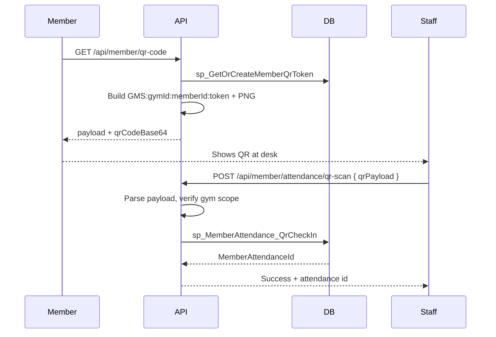

# QR Check-In

## Status

**Partially implemented.** Backend APIs, database objects, QR generation, and member-side QR display exist. Staff-side QR scanning UI, class-booking QR UI, FluentValidation, and booking QR integration tests are missing. There is no standalone “QR Check-In” module or sidebar menu item.

---

## Features Implemented

### Member attendance QR (backend)

| Layer | Implementation |
|-------|----------------|
| **Table** | `dbo.MemberQrTokens` — one persistent token per member (`MemberId` PK, `GymId`, `QrToken`, `CreatedDate`, `RotatedDate`) |
| **Stored procedures** | `dbo.sp_GetOrCreateMemberQrToken`, `dbo.sp_MemberAttendance_QrCheckIn` |
| **Repository** | `MemberSelfServiceRepository.GetOrCreateQrTokenAsync`, `MemberSelfServiceRepository.QrCheckInAsync` (Dapper → stored procedures) |
| **Service** | `MemberSelfService.GetQrCodeAsync`, `MemberSelfService.ScanQrCheckInAsync` |
| **QR generation** | `IQrCodeGenerator` / `QrCodeGeneratorService` (QRCoder → Base64 PNG) |
| **Payload format** | `GMS:{gymId}:{memberId}:{qrToken}` |
| **API — generate** | `GET /api/member/qr-code` |
| **API — scan** | `POST /api/member/attendance/qr-scan` with `{ "qrPayload": "GMS:..." }` |
| **Attendance integration** | Inserts into `dbo.MemberAttendance` with note `QR check-in`; rejects duplicate same-day check-in and open sessions |
| **Audit** | `MemberSelfService.ScanQrCheckInAsync` logs audit entry with `QrCheckIn: true` |

### Class booking QR check-in (backend)

| Layer | Implementation |
|-------|----------------|
| **Stored procedure** | `dbo.sp_BookingQrCheckIn` — validates token in `MemberQrTokens`, finds today’s `Booked` slot, sets `SlotBookings.Status = CheckedIn`, optionally inserts `MemberAttendance` if none today |
| **Repository** | `BookingRepository.QrCheckInAsync` |
| **Service** | `BookingService.CheckInAsync` — parses same `GMS:` payload, enforces gym scope |
| **API** | `POST /api/booking-checkin` with `{ "qrPayload": "GMS:..." }` |
| **Audit** | Logs `SlotBooking` check-in via `IAuditService` |

### Member UI — QR display

| Item | Location |
|------|----------|
| **Component** | `member-dashboard.component` (`/member/dashboard`) |
| **Service** | `MemberSelfServiceService.getQrCode()` → `GET /api/member/qr-code` |
| **UI** | Inline “Check-in QR” image (`qrCodeBase64`) with copy “Scan at the front desk” |

### Integration tests (member attendance QR only)

| Test | File |
|------|------|
| `GetQrCode_ReturnsOkWithPayload` | `Gym.API.IntegrationTests/MemberSelfServiceTests.cs` |
| `QrCheckIn_AdminCanScanMemberQr` | Same file — member fetches QR, gym admin posts to `qr-scan`, duplicate scan expects failure |

---

## Features Not Implemented or Missing

| Area | Status |
|------|--------|
| **Angular QR scanner** | No component uses camera/barcode input or calls `POST /api/member/attendance/qr-scan` |
| **Angular booking QR check-in** | `BookingService.checkIn(qrPayload)` exists but no component invokes it |
| **Member self-service scan API on frontend** | `MemberSelfServiceService` exposes `getQrCode()` only — no `qr-scan` wrapper |
| **Dedicated QR routes** | No `/gym-admin/.../qr-scan` or similar route |
| **Sidebar menu** | No menu item labeled “QR Check-In”; attendance menu links to manual check-in at `/gym-admin/attendance/check-in` |
| **FluentValidation** | No validators for `QrCheckInDto` or `BookingCheckInDto` |
| **Booking QR integration tests** | None found |
| **QR token rotation / expiry** | `RotatedDate` column exists; no rotation logic or expiry enforcement in application code |
| **Dedicated subscription feature code** | No `QR_CHECKIN` SaaS feature; see Feature Flags below |
| **Mobile QR scan endpoint** | `MobileFeatureFlagsDto.QrCheckIn` is a static flag only; no mobile-specific scan API |

### Related but not QR

Gym-admin **manual** member check-in (`/gym-admin/attendance/check-in`, `/trainer/attendance/check-in`) uses `POST /api/attendance/check-in` with a **member ID dropdown**, not QR scanning (`attendance-check-in.component`).

---

## Database Objects

### Tables

| Object | Script | Purpose |
|--------|--------|---------|
| `dbo.MemberQrTokens` | `029_MemberSelfServiceModule.sql` | Stores per-member QR token used by both attendance and booking QR flows |
| `dbo.MemberAttendance` | Attendance module scripts | Target row for attendance QR check-in |
| `dbo.SlotBookings` | `033_BookingAndSlotReservationModule.sql` | Updated to `CheckedIn` by booking QR flow |

**Note:** `dbo.MemberQrCodes` is **not** defined anywhere in the solution. Migration `074_AttendanceOpenSessionFix.sql` redefines `sp_MemberAttendance_QrCheckIn` to query `MemberQrCodes`, which conflicts with `MemberQrTokens` used everywhere else. If script `074` has been applied, attendance QR scan can fail at runtime until the procedure is corrected to use `MemberQrTokens`.

### Stored procedures

| Procedure | Script | Purpose |
|-----------|--------|---------|
| `dbo.sp_GetOrCreateMemberQrToken` | `029_MemberSelfServiceModule.sql` | Returns existing or creates new token in `MemberQrTokens` |
| `dbo.sp_MemberAttendance_QrCheckIn` | `029_MemberSelfServiceModule.sql` (original); overwritten in `074_AttendanceOpenSessionFix.sql` | Validates token; inserts attendance record |
| `dbo.sp_BookingQrCheckIn` | `033_BookingAndSlotReservationModule.sql` | Validates token; checks in today’s booking; may insert attendance |

---

## APIs

| Method | Endpoint | Permission | SaaS feature gate |
|--------|----------|------------|-------------------|
| `GET` | `/api/member/qr-code` | `VIEW_MEMBER_DASHBOARD` | Not mapped in `ApiRouteFeatureMap` (member self-service prefix excluded from generic gating) |
| `POST` | `/api/member/attendance/qr-scan` | `MANAGE_ATTENDANCE` | Not mapped in `ApiRouteFeatureMap` |
| `POST` | `/api/booking-checkin` | `MANAGE_BOOKINGS` | `BOOKINGS` (`ApiRouteFeatureMap`) |

### DTOs

| DTO | File | Fields |
|-----|------|--------|
| `MemberQrCodeDto` | `MemberSelfServiceDtos.cs` | `Payload`, `QrCodeBase64`, `MemberId` |
| `QrCheckInDto` | `MemberSelfServiceDtos.cs` | `QrPayload` |
| `BookingCheckInDto` | `BookingDtos.cs` | `QrPayload` |

### Controllers

- `MemberSelfServiceController` — `api/member` routes for QR generate and attendance scan
- `BookingCheckInController` — `api/booking-checkin`

---

## UI Pages

| Role | Route | QR behavior |
|------|-------|-------------|
| Member | `/member/dashboard` | **Displays** QR image (generate only) |
| Gym admin | `/gym-admin/attendance/check-in` | Manual member dropdown check-in — **no QR** |
| Gym admin | `/gym-admin/attendance` | Links to manual check-in — **no QR** |
| Trainer | `/trainer/attendance/check-in` | Same manual check-in component — **no QR** |
| Any | — | **No** booking QR scan page |

---

## Business Workflow

### Attendance QR (intended end-to-end)

1. Member opens dashboard; app loads QR via API.
2. Token is created once per member in `MemberQrTokens` and embedded in payload `GMS:{gymId}:{memberId}:{token}`.
3. Staff (with `MANAGE_ATTENDANCE`) scans payload — **today only via API or external tool**; Angular has no scanner page.
4. Procedure validates token and active member, rejects duplicate today / open session, inserts `MemberAttendance`.

### Class booking QR (API-only UI)

1. Same member QR payload is submitted to `POST /api/booking-checkin`.
2. `sp_BookingQrCheckIn` validates token, selects earliest today `Booked` slot, marks `CheckedIn`, may add attendance if missing for the day.
3. Requires `MANAGE_BOOKINGS` and `BOOKINGS` plan feature.

---

## Permissions

| Permission | Used for |
|------------|----------|
| `VIEW_MEMBER_DASHBOARD` | Member generates QR (`GET /api/member/qr-code`) |
| `MANAGE_ATTENDANCE` | Staff attendance QR scan (`POST /api/member/attendance/qr-scan`); also enforced in `MemberSelfService.ScanQrCheckInAsync` |
| `MANAGE_BOOKINGS` | Class booking QR check-in (`POST /api/booking-checkin`) |

Attendance menu permissions (`VIEW_ATTENDANCE`, `MANAGE_ATTENDANCE`) cover the attendance module generally; they do not add a separate QR menu entry.

---

## Feature Flags

| Mechanism | QR-related behavior |
|-----------|---------------------|
| `ApiRouteFeatureMap` | `/api/booking-checkin` → `BOOKINGS` only |
| `ApiRouteFeatureMap` | `/api/attendance` → `ATTENDANCE` (manual check-in APIs, not QR scan) |
| `MobileFeatureFlagsDto.QrCheckIn` | Hard-coded `true` in `MobilePushService`; not wired to backend QR endpoints |
| Subscription plans | No dedicated `QR_CHECKIN` feature code in codebase |

---

## Limitations

1. **No staff scanner UI** — QR check-in cannot be completed from the Angular app without custom API clients; only manual member-ID check-in is available in the UI.
2. **No booking QR UI** — `BookingService.checkIn()` is unused in the frontend.
3. **No FluentValidation** on QR DTOs; invalid payloads are handled in service-layer parsing only.
4. **No booking QR integration tests** — only member attendance QR is covered.
5. **Single shared token** — no rotation, revocation, or expiry despite `RotatedDate` column.
6. **Migration 074 inconsistency** — if applied, `sp_MemberAttendance_QrCheckIn` references non-existent `MemberQrCodes` while tokens live in `MemberQrTokens`; attendance QR may break until fixed.
7. **Same QR for two flows** — one payload serves both attendance scan and booking check-in; booking flow additionally requires an active same-day `Booked` slot.
8. **No dedicated module boundary** — QR logic is embedded in Member Self-Service and Booking modules, not a standalone QR Check-In feature area.
