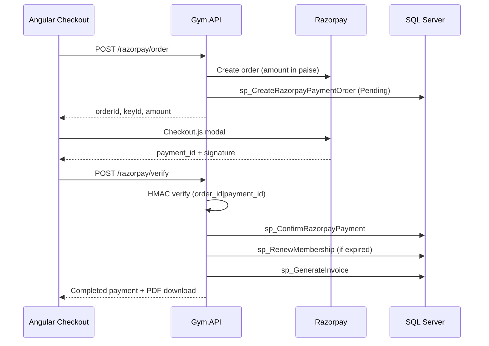

# Razorpay Payment Gateway — Deployment Notes

## Overview

Online membership payments use Razorpay Checkout with server-side order creation, HMAC signature verification, Dapper stored procedures, and multi-tenant `GymId` isolation.

**Migration script:** `023_RazorpayPaymentModule.sql`

---

## 1. Database migration

```bash
dotnet run --project Backend/Gym.API -- migrate
```

Verify in SQL Server:

```sql
SELECT ScriptName FROM dbo.SchemaVersions WHERE ScriptName = '023_RazorpayPaymentModule.sql';
SELECT TOP 1 RazorpayOrderId, RazorpayPaymentId, Status FROM dbo.Payments WHERE PaymentMethod = N'Razorpay';
```

Re-run seed (or restart API with `Database:RunSeedOnStartup=true`) to add permissions:

| Permission | Roles |
|------------|-------|
| `INITIATE_ONLINE_PAYMENT` | GymAdmin, Member |
| `REFUND_PAYMENT` | GymAdmin, SuperAdmin |

---

## 2. Razorpay dashboard setup

1. Create a Razorpay account at [https://dashboard.razorpay.com](https://dashboard.razorpay.com).
2. Generate **API Keys** (Test mode for staging, Live for production).
3. Note **Key ID** (`rzp_test_…` / `rzp_live_…`) and **Key Secret**.
4. (Optional) Configure webhooks later; current flow uses client-side checkout + server verify endpoint.

---

## 3. Backend configuration

### `appsettings.Production.json` (or environment variables)

```json
{
  "Razorpay": {
    "Enabled": true,
    "KeyId": "rzp_live_XXXXXXXXXXXXXXXX",
    "KeySecret": "YOUR_KEY_SECRET",
    "Currency": "INR"
  }
}
```

### Environment variable overrides (Azure / Docker)

```
Razorpay__Enabled=true
Razorpay__KeyId=rzp_live_XXXX
Razorpay__KeySecret=XXXX
Razorpay__Currency=INR
```

**Never commit Key Secret to source control.**

---

## 4. API endpoints

| Method | Route | Permission | Purpose |
|--------|-------|------------|---------|
| GET | `/api/payments/razorpay/checkout-context` | `INITIATE_ONLINE_PAYMENT` | Member payable membership |
| POST | `/api/payments/razorpay/order` | `INITIATE_ONLINE_PAYMENT` | Create Razorpay order + pending payment |
| POST | `/api/payments/razorpay/verify` | `INITIATE_ONLINE_PAYMENT` | Verify signature, complete payment, renew membership, generate invoice |
| POST | `/api/payments/{id}/refund` | `REFUND_PAYMENT` | Admin refund via Razorpay API |
| GET | `/api/payments` | `VIEW_PAYMENTS` | Payment history (gym admin) |

---

## 5. Stored procedures

| Procedure | Purpose |
|-----------|---------|
| `sp_CreateRazorpayPaymentOrder` | Insert `Pending` Razorpay payment |
| `sp_GetPaymentByRazorpayOrderId` | Lookup by order id |
| `sp_ConfirmRazorpayPayment` | Mark `Completed`, store payment id, optional membership renewal |
| `sp_FailRazorpayPayment` | Mark `Failed` |
| `sp_RefundPayment` | Mark `Refunded` |
| `sp_GetMemberPayableMembership` | Latest membership for member checkout |
| `sp_GetPaymentHistory` / `sp_GetMemberPaymentHistory` | Include Razorpay columns |

---

## 6. Payment flow



---

## 7. Frontend deployment

- Angular loads `https://checkout.razorpay.com/v1/checkout.js` dynamically.
- Member route: `/member/checkout` (menu: **Pay Membership**).
- Gym admin payment history: `/gym-admin/payments` (status, Razorpay reference, refund).

Build:

```bash
cd Frontend/gym-app
npm ci
npm run build
```

Ensure API proxy / CORS allows the frontend origin and cookie auth if used.

---

## 8. Testing (Razorpay test mode)

1. Set `Razorpay:Enabled=true` with test keys.
2. Log in as demo member (`admin@fitzone-demo.com` is GymAdmin; use a Member account for checkout).
3. Open `/member/checkout` → **Pay with Razorpay**.
4. Use Razorpay test card: `4111 1111 1111 1111`, any future expiry, any CVV.
5. Confirm payment history shows `Completed`, invoice PDF downloads, membership renewed if expired.

---

## 9. Audit trail

| Event | Entity | Action |
|-------|--------|--------|
| Order created | Payment | Create |
| Verify success | Payment | Update |
| Verify failure | Payment | PaymentFailed |
| Membership renewed | Membership | Renew |
| Refund | Payment | Refund |

View in **Audit Logs** (`VIEW_AUDIT_LOGS`).

---

## 10. Production checklist

- [ ] Run migration `023`
- [ ] Seed new permissions / assign to roles
- [ ] Configure live Razorpay keys via secure config
- [ ] Enable HTTPS (required for checkout)
- [ ] Verify `GymId` tenant isolation on all payment SPs
- [ ] Restrict `REFUND_PAYMENT` to GymAdmin only
- [ ] Monitor failed payments in audit logs and `Status = Failed`
- [ ] Backup SQL Server before first production payment

---

## 11. Troubleshooting

| Symptom | Check |
|---------|-------|
| "Razorpay is not configured" | `Razorpay:Enabled=true`, KeyId/KeySecret set |
| Invalid signature | Key secret mismatch; verify test vs live keys |
| Pending payment exists | Complete or fail existing order for membership |
| Amount mismatch | Membership amount must match plan price |
| 403 on checkout | User lacks `INITIATE_ONLINE_PAYMENT` — re-seed privileges |
