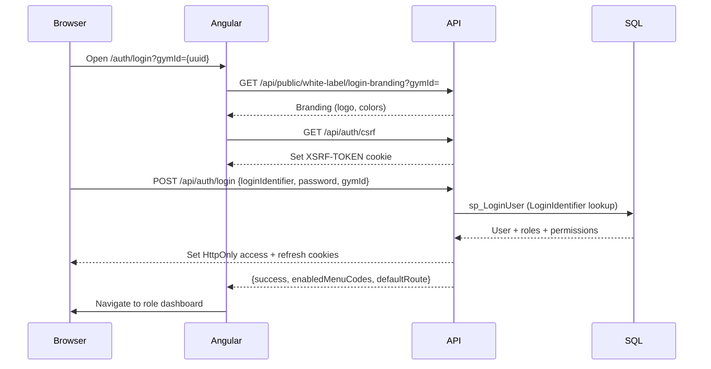

# System Architecture — Gym Management SaaS v1.0.0-RC1

Technical architecture reference for the Gym Management SaaS platform.

---

## 1. High-Level Architecture

```
┌─────────────────────────────────────────────────────────────────────────┐
│                         CLIENT TIER                                      │
│  ┌──────────────┐  ┌──────────────┐  ┌──────────────┐  ┌─────────────┐ │
│  │ Super Admin  │  │  Gym Admin   │  │   Trainer    │  │   Member    │ │
│  │   Portal     │  │   Portal     │  │   Portal     │  │   Portal    │ │
│  └──────┬───────┘  └──────┬───────┘  └──────┬───────┘  └──────┬──────┘ │
│         │                 │                 │                 │         │
│  ┌──────┴─────────────────┴─────────────────┴─────────────────┴──────┐ │
│  │              Angular 19 SPA (GymManagementSystem-UI)               │ │
│  │  Guards · Interceptors · Material UI · Standalone Components        │ │
│  └──────────────────────────────┬────────────────────────────────────┘ │
└─────────────────────────────────┼───────────────────────────────────────┘
                                  │ HTTPS  /api/*
┌─────────────────────────────────▼───────────────────────────────────────┐
│                         API TIER                                         │
│  ┌─────────────────────────────────────────────────────────────────────┐│
│  │  ASP.NET Core 8 — Gym.API                                           ││
│  │  Middleware: CorrelationId → Logging → Exception → CSRF → Auth      ││
│  │            → Authorization → GymMenuAccess                          ││
│  │  Controllers → MediatR → Application Services → Repositories        ││
│  └──────────────────────────────┬──────────────────────────────────────┘│
└─────────────────────────────────┼───────────────────────────────────────┘
                                  │ Dapper (parameterized)
┌─────────────────────────────────▼───────────────────────────────────────┐
│                         DATA TIER                                        │
│  ┌─────────────────────────────────────────────────────────────────────┐│
│  │  SQL Server — GymDb                                                 ││
│  │  Stored Procedures (dbo.sp_*) · Multi-tenant by GymId               ││
│  │  EF Core: migrations + SchemaVersions tracking only                 ││
│  └─────────────────────────────────────────────────────────────────────┘│
└─────────────────────────────────────────────────────────────────────────┘
```

---

## 2. Multi-Tenant Architecture

### 2.1 Tenancy model

| Concept | Implementation |
|---------|----------------|
| **Tenant** | A gym (`dbo.Gyms.GymId` — `UNIQUEIDENTIFIER`) |
| **Platform scope** | Super Admin users have `GymId = NULL` |
| **Tenant users** | Gym Admin, Trainer, Member belong to exactly one gym |
| **Data isolation** | Every gym-scoped table includes `GymId`; SPs filter by `@GymId` |
| **Cross-tenant queries** | Super Admin only; optional `gymId` query parameter |

### 2.2 Isolation enforcement layers

```
Request → JWT/Cookie Claims (GymId, UserId, Roles, Permissions)
       → ICurrentUserService (application layer)
       → Service methods (ResolveGymScope, ResolveGymIdForMutation)
       → Repository (@GymId parameter)
       → Stored Procedure (WHERE GymId = @GymId AND IsDeleted = 0)
```

### 2.3 Tenant feature flags (menus)

```
dbo.Menus          — global module catalog (MEMBERS, LEADS, PAYMENTS, …)
dbo.GymMenus       — per-gym IsEnabled flag
GymMenuAccessMiddleware — blocks API when module disabled for gym
Angular gymMenuGuard    — hides routes in sidebar
```

Default: all menus **enabled** for existing gyms (migration 052).

---

## 3. Authentication Flow

### 3.1 LoginIdentifier model

| User type | LoginIdentifier scope | GymId at login |
|-----------|----------------------|----------------|
| Super Admin | Platform-wide unique | Not required |
| Gym Admin / Trainer / Member | Unique within gym | Required (query param or branding context) |

Rules: max 20 chars, pattern `[a-zA-Z0-9._-]+`, case-normalized.

### 3.2 Browser login sequence



### 3.3 Token and session

| Component | Detail |
|-----------|--------|
| Access token | JWT in HttpOnly cookie (`gym_access_token`) |
| Refresh token | HttpOnly cookie on `/api/auth` path |
| CSRF | Double-submit: `XSRF-TOKEN` cookie + `X-XSRF-TOKEN` header |
| Session refresh | `GET /api/auth/session` reloads permissions without re-login |
| Expiry | Access: 60 min default; Refresh: 7 days default |

---

## 4. Authorization Flow

### 4.1 RBAC model

```
Users ──► UserRoles ──► Roles ──► RolePrivileges ──► Privileges
```

Permissions are string codes (e.g. `VIEW_MEMBERS`, `CREATE_MEMBERSHIP`, `MANAGE_NOTIFICATIONS`).

### 4.2 API authorization

```csharp
[Authorize]
[RequirePermission(Permissions.ViewMembers)]
public async Task<ActionResult> GetMembers(...) { }
```

`RequirePermission` handler checks JWT/cookie claims against required permission.

### 4.3 Frontend authorization

| Layer | Mechanism |
|-------|-----------|
| Route guard | `authGuard`, `roleGuard`, `gymMenuGuard` |
| Menu visibility | `enabledMenuCodes` from login response + `AuthService.hasPermission()` |
| UI elements | `@if (auth.hasPermission(...))` in templates |

### 4.4 Tenant menu + permission interaction

A user needs **both**:
1. RBAC permission for the action, **and**
2. Module enabled in `GymMenus` for their gym

If menu disabled → **403 Forbidden** even with permission.

---

## 5. GymId Isolation

### 5.1 Claim resolution

After login, `GymId` is embedded in JWT claims. `ICurrentUserService.GymId` returns:
- `null` for Super Admin
- Gym UUID for tenant users

### 5.2 Service patterns

| Pattern | Usage |
|---------|--------|
| `ResolveGymScope()` | Read queries — Super Admin may pass explicit gymId |
| `ResolveGymIdForMutation(dto.GymId)` | Writes — always scoped to user's gym |
| `ResolveGymScopeForMember(member.GymId)` | Entity-level gym validation |
| Trainer filter | Trainers see only assigned members |

### 5.3 Stored procedure convention

```sql
CREATE PROCEDURE dbo.sp_GetAllMembers
    @GymId UNIQUEIDENTIFIER,
    @Search NVARCHAR(100) = NULL,
    ...
AS
BEGIN
    SELECT ... FROM dbo.Members m
    WHERE m.GymId = @GymId AND m.IsDeleted = 0
    ...
END
```

Super Admin list procedures use `@GymId IS NULL OR m.GymId = @GymId`.

---

## 6. Module Architecture

### 6.1 Backend (Clean Architecture)

```
Gym.API/              Controllers, middleware, DI composition
Gym.Application/      Commands, queries (MediatR), DTOs, validators, services
Gym.Domain/           Entities, enums, domain interfaces
Gym.Infrastructure/   Dapper repositories, SP executor, SQL scripts, integrations
```

**Request flow:**

```
HTTP Request → Controller → MediatR → Handler → Service → Repository → SP → SQL Server
```

### 6.2 Module map

| Module | API Area | Key Tables | Script |
|--------|----------|------------|--------|
| Auth | `/api/auth` | Users, RefreshTokens | 006–007, 051 |
| Members | `/api/members` | Members | 011 |
| Trainers | `/api/trainers` | Trainers | 010 |
| Memberships | `/api/memberships` | Memberships, Plans | 012 |
| Payments | `/api/payments` | Payments | 012, 023 |
| Attendance | `/api/attendance` | Attendance | 013 |
| Diet | `/api/diet-plans` | DietPlans, Assignments | 015 |
| Workout | `/api/workout-plans` | WorkoutPlans, Exercises | 016 |
| CRM | `/api/leads` | Leads | 027 |
| Analytics | `/api/analytics` | Aggregations | 025 |
| Branches | `/api/branches` | Branches | 030 |
| White Label | `/api/white-label` | BrandingSettings | 035 |
| Website | `/api/website` | WebsitePages | 034 |
| Notifications | `/api/notifications` | Templates, Logs | 024 |
| SaaS | `/api/saas` | Subscriptions, Limits | 026 |
| Tenant Menus | `/api/menus`, `/api/platform/tenant-menus` | Menus, GymMenus | 052 |
| Audit | `/api/audit-logs` | AuditLogs | 014 |
| Files | `/api/files` | FileMetadata | 017 |
| Bookings | `/api/bookings` | Schedules, Bookings | 033 |
| AI | `/api/ai` | Recommendations | 032 |
| Push | `/api/mobile` | DeviceTokens, Campaigns | 031 |

### 6.3 Frontend (Angular)

```
src/app/
├── core/           Services, guards, interceptors, constants
├── shared/         Reusable components, models
├── features/
│   ├── auth/           Login, password reset
│   ├── super-admin/    Platform management, tenant menus
│   ├── gym-admin/      All gym operations (largest module)
│   ├── trainer/        Trainer portal
│   ├── member/         Member self-service
│   └── public/         Public gym website
```

Each gym-admin submodule maps to a `MenuCode` and route under `/gym-admin/*`.

---

## 7. Database Architecture

### 7.1 Design principles

| Principle | Implementation |
|-----------|----------------|
| Business logic in SQL | Stored procedures with TRY/CATCH |
| No EF runtime queries | Dapper + `IStoredProcedureExecutor` only |
| Soft delete | `IsDeleted` / `IsActive` flags |
| Migration tracking | `dbo.SchemaVersions` + EF migrations |
| Parameterized queries | Never concatenate SQL in C# |

### 7.2 Core entity relationships

```
Gyms (tenant root)
 ├── Users (LoginIdentifier, GymId FK)
 │    ├── GymAdmins
 │    ├── Trainers
 │    └── Members
 ├── GymMenus (feature flags)
 ├── MembershipPlans → Memberships → Payments
 ├── Leads → (convert) → Members
 ├── Branches
 ├── DietPlans / WorkoutPlans → Assignments
 ├── NotificationTemplates / Logs
 ├── WebsitePages
 └── BrandingSettings
```

### 7.3 Schema deployment

1. **EF Core migrations** — baseline schema, Identity tables
2. **Embedded SQL scripts 001–052** — applied in order by `DatabaseMigrator`
3. **Validation** — critical column/procedure existence checks post-migration

```powershell
dotnet run --project Backend/Gym.API -- migrate
```

### 7.4 Indexing (production)

Script `021_PerformanceIndexes.sql` adds indexes for:
- Attendance (date, member, gym)
- Memberships (status, end date)
- Payments (date, member)
- Audit logs (entity, timestamp)

---

## 8. External Integrations

| Integration | Provider | Config section | Required |
|-------------|----------|----------------|----------|
| Online payments | Razorpay | `Razorpay` | Optional |
| WhatsApp | Interakt (Mock default) | `WhatsApp` | Optional |
| Push notifications | Firebase (Mock default) | `Firebase` | Optional |
| AI insights | OpenAI (Mock default) | `AI` | Optional |
| File storage | Local / Azure Blob | `FileStorage` | Required |
| Telemetry | Application Insights | `ApplicationInsights` | Recommended |

All integrations degrade gracefully when disabled (Mock providers for dev/staging).

---

## 9. Security Architecture Summary

| Control | Layer |
|---------|-------|
| Authentication | Cookie JWT + refresh rotation |
| CSRF | Middleware on mutating requests |
| Authorization | Permission claims + menu middleware |
| Tenancy | GymId in claims, SPs, services |
| Rate limiting | Auth endpoints |
| Audit | All sensitive mutations logged |
| Transport | HTTPS / HSTS in production |

---

## Related Documents

- [Backend/ARCHITECTURE.md](./Backend/ARCHITECTURE.md) — Stored procedure conventions
- [DEPLOYMENT_GUIDE.md](./DEPLOYMENT_GUIDE.md) — Deployment topology
- [docs/PROJECT_SUMMARY.md](./docs/PROJECT_SUMMARY.md) — Feature-by-feature UI summary
